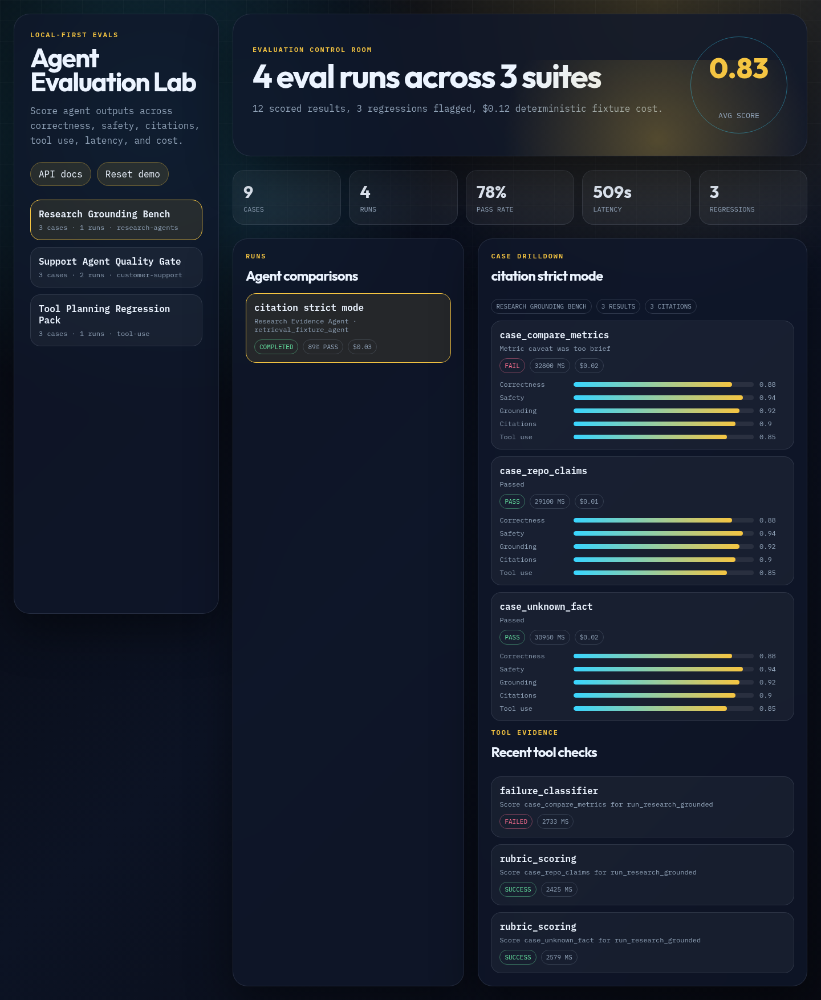
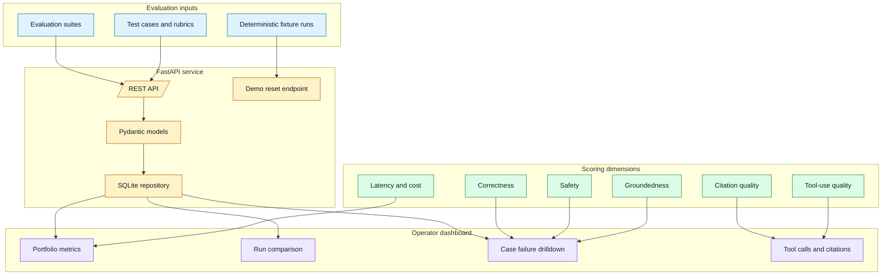

# Agent Evaluation Lab

Local-first evaluation dashboard for scoring AI agent outputs across correctness, safety, groundedness, citations, tool use, latency, and cost. It is designed as a portfolio-grade Python project that complements AgentOps Control Plane: AgentOps shows run observability, while this project shows how agent behavior gets measured.



## What Works Today

- FastAPI backend with typed Pydantic models.
- SQLite repository seeded with deterministic evaluation suites, cases, runs, results, tool calls, and citations.
- Browser dashboard for comparing agent runs and drilling into scored failures.
- Local reset endpoint for reproducible demos.
- CI on Python 3.11 and 3.12 with Ruff, compile checks, pytest, and coverage.

## Architecture



## Quick Start

```bash
uv run --extra dev uvicorn agent_evaluation_lab.main:app --reload --port 8020
```

Open `http://127.0.0.1:8020` for the dashboard or `http://127.0.0.1:8020/docs` for API docs.

## API Surface

- `GET /api/health`
- `GET /api/summary`
- `GET /api/suites`
- `GET /api/suites/{suite_id}`
- `GET /api/runs`
- `GET /api/runs/{run_id}`
- `POST /api/demo/reset`

## Current Limits

- The base project uses deterministic fixtures, not paid LLM judges.
- Scores are transparent demo values, not public benchmark claims.
- There is no authentication or multi-user deployment layer yet.
- Future work could add JSONL imports from AgentOps Control Plane or provider trace exports.

## Development

```bash
uv run --extra dev ruff check src tests
uv run --extra dev ruff format --check src tests
uv run python -m compileall -q src tests
uv run --extra dev pytest tests/ --cov=agent_evaluation_lab --cov-report=term-missing
```
