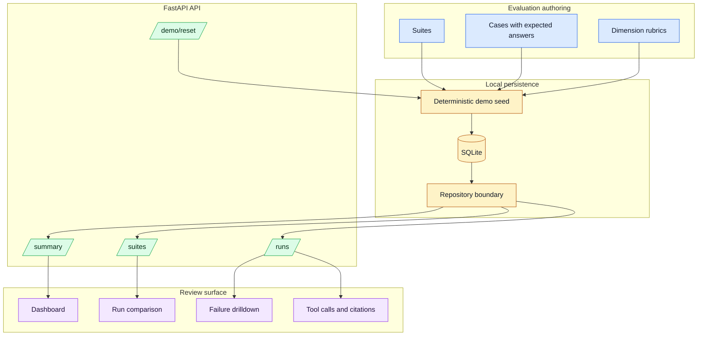

# Architecture

Agent Evaluation Lab is a local-first FastAPI application backed by SQLite. It avoids external model providers in the base demo so every dashboard, API response, and test run is reproducible.

## Data Flow

## Main Components

- `models.py`: Pydantic models for suites, cases, runs, results, tool calls, citations, and summary rollups.
- `demo_data.py`: deterministic fixture data with fixed timestamps, costs, pass rates, and scoring outcomes.
- `repository.py`: SQLite table creation, seed/reset behavior, query methods, and summary aggregation.
- `api.py`: FastAPI routes for dashboard data and demo reset.
- `web_assets/`: vanilla HTML/CSS/JS dashboard served by the FastAPI app.

## Boundaries

The project intentionally does not call an LLM judge. That keeps the base demo deterministic and honest. A later PR can add optional imports from real trace/eval exports while preserving deterministic fixtures for CI.
